<!-- markdownlint-disable MD041 -->
<a href="assets/hero-light.svg#gh-light-mode-only">
  <picture>
    <source media="(max-width: 600px)" srcset="assets/hero-mobile-light.svg">
    
  </picture>
</a>
<a href="assets/hero-dark.svg#gh-dark-mode-only">
  <picture>
    <source media="(max-width: 600px)" srcset="assets/hero-mobile-dark.svg">
    
  </picture>
</a>

 

  <a href="README.md"><picture><source media="(prefers-color-scheme: dark)" srcset="assets/button-nav-en-dark.svg"></picture></a>
  <a href="#我的工作台"><picture><source media="(prefers-color-scheme: dark)" srcset="assets/button-nav-projects-dark.svg">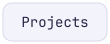</picture></a>
  <a href="#常用工具"><picture><source media="(prefers-color-scheme: dark)" srcset="assets/button-nav-stack-dark.svg"></picture></a>
  <a href="#持续构建"><picture><source media="(prefers-color-scheme: dark)" srcset="assets/button-nav-github-dark.svg"></picture></a>
  <a href="mailto:edwardwang33773@gmail.com"><picture><source media="(prefers-color-scheme: dark)" srcset="assets/button-nav-contact-zh-dark.svg"></picture></a>

# 嗨，我是 Eden

我做 AI Agent，也做围绕它的工具。最近最让我着迷的，是**模型给出回答之后，到任务真正完成之前**的过程：上下文、工具、人的决策，以及它确实做对了的证据。

现在主要在做 coding agent，从运行时一路做到产品交付。做后端时养成的习惯还在：遇到问题，总想往底下多看一层。

**正在寻找 AI Agent Engineering 岗位，也考虑远程。** 已完成香港大学计算机科学硕士学业，预计 2026 年 11 月授位。

## 我的工作台

<a href="https://github.com/DrEden33773/adam-agent#gh-light-mode-only">
  <picture>
    <source media="(max-width: 600px)" srcset="assets/project-adam-agent-mobile-light.svg">
    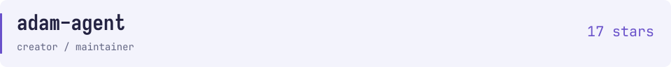
  </picture>
</a>
<a href="https://github.com/DrEden33773/adam-agent#gh-dark-mode-only">
  <picture>
    <source media="(max-width: 600px)" srcset="assets/project-adam-agent-mobile-dark.svg">
    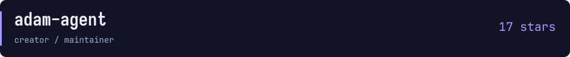
  </picture>
</a>

一个能看清内部过程的 coding agent。我探索 **工具审批、会话恢复、上下文压缩、Skills、MCP 和子 Agent 协作**的主要阵地，用 TypeScript 一路做到终端交互。

我也做真实仓库修复任务的配对评测，拿原始测试日志复核判分。[这里记录了实验、修正和结果](https://github.com/DrEden33773/adam-agent/blob/main/docs/agent-evaluation-evidence.md)。

<a href="https://github.com/AI-Eden/eden-skills#gh-light-mode-only">
  <picture>
    <source media="(max-width: 600px)" srcset="assets/project-eden-skills-mobile-light.svg">
    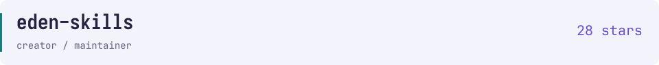
  </picture>
</a>
<a href="https://github.com/AI-Eden/eden-skills#gh-dark-mode-only">
  <picture>
    <source media="(max-width: 600px)" srcset="assets/project-eden-skills-mobile-dark.svg">
    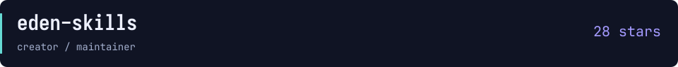
  </picture>
</a>

用 Rust 写的 CLI，管理 **40+ 种 Agent 工具**的 Skills，支持本地和 Docker。声明式安装、有界并发，状态出了问题就用 `doctor` / `repair` 排查修复。它也是我实践人在回路、多 Agent 协作开发的地方。

<a href="https://github.com/KaiOnCode/QuanTable#gh-light-mode-only">
  <picture>
    <source media="(max-width: 600px)" srcset="assets/project-QuanTable-mobile-light.svg">
    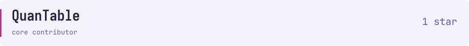
  </picture>
</a>
<a href="https://github.com/KaiOnCode/QuanTable#gh-dark-mode-only">
  <picture>
    <source media="(max-width: 600px)" srcset="assets/project-QuanTable-mobile-dark.svg">
    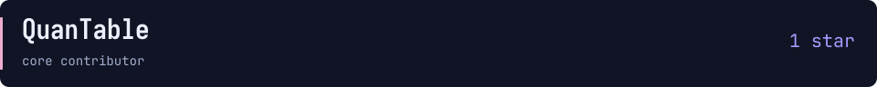
  </picture>
</a>

和团队一起做的量化研究工作台。我负责的部分横跨 Next.js、FastAPI 与存储：**自然语言选股、刷新后可以恢复的流式进度，以及确定性回测**。

## 常用工具

<a href="assets/stack-light.svg#gh-light-mode-only">
  <picture>
    <source media="(max-width: 600px)" srcset="assets/stack-mobile-light.svg">
    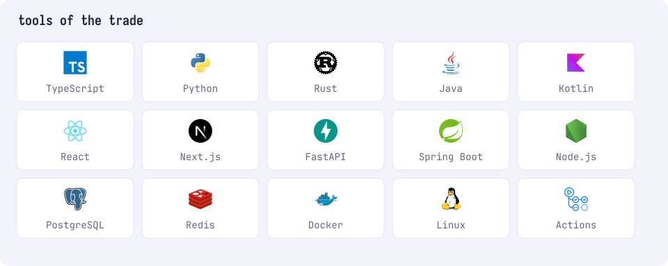
  </picture>
</a>
<a href="assets/stack-dark.svg#gh-dark-mode-only">
  <picture>
    <source media="(max-width: 600px)" srcset="assets/stack-mobile-dark.svg">
    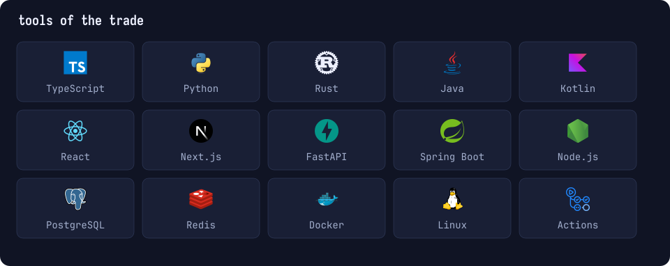
  </picture>
</a>

用 TypeScript 写 Agent 和界面，用 Python 做服务和评测，用 Rust 做工具。**后端用 Java / Spring Boot，并发流水线用 Kotlin 协程。**

再往技术细节里看一点

- **Agent 系统：** 工具调用、上下文与会话管理、子 Agent、MCP、Skills、人工审批。
- **产品交付：** React / Next.js、FastAPI、Java / Spring Boot、SSE、SQLite、PostgreSQL、Redis。
- **运行环境：** Linux、Docker、CI/CD、异步运行时、并发控制。
- **此前：** 在广东小天才做 Java / Spring Boot 后端，也用 Kotlin 协程搭建审核流水线，处理每两周约百万新增题目的审核需求。

## 持续构建

<a href="https://github.com/DrEden33773?tab=overview#gh-light-mode-only">
  <picture>
    <source media="(max-width: 600px)" srcset="assets/github-mobile-light.svg">
    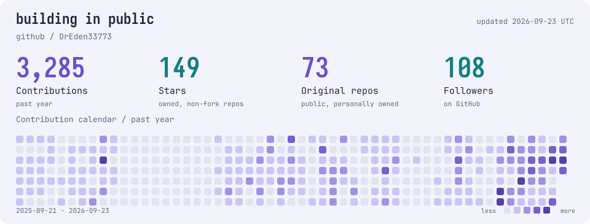
  </picture>
</a>
<a href="https://github.com/DrEden33773?tab=overview#gh-dark-mode-only">
  <picture>
    <source media="(max-width: 600px)" srcset="assets/github-mobile-dark.svg">
    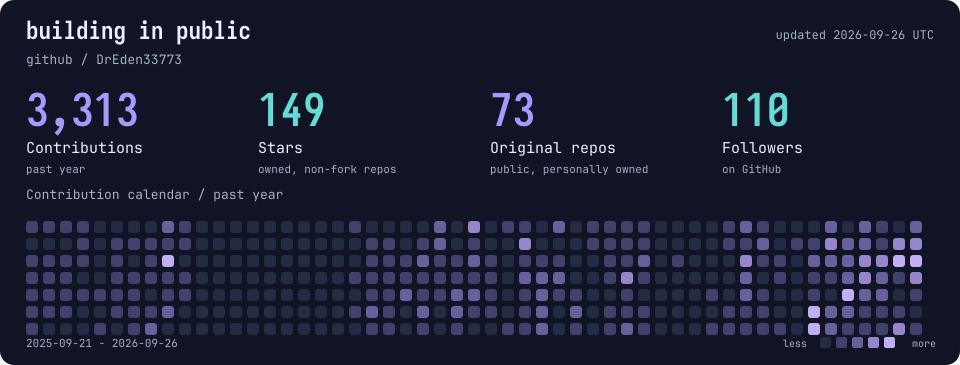
  </picture>
</a>

仓库数和 Stars 汇总仅统计个人名下的公开非 fork 仓库；项目卡单独展示各项目的 Stars。[数据快照](data/github.json)。

 

<a href="assets/contact-light.svg#gh-light-mode-only">
  <picture>
    <source media="(max-width: 600px)" srcset="assets/contact-mobile-light.svg">
    
  </picture>
</a>
<a href="assets/contact-dark.svg#gh-dark-mode-only">
  <picture>
    <source media="(max-width: 600px)" srcset="assets/contact-mobile-dark.svg">
    
  </picture>
</a>

   
  <strong>如果你也在做 coding agent、开发者工具， 或者正在组建这样的团队，欢迎聊聊。</strong>

  <a href="mailto:edwardwang33773@gmail.com"><picture><source media="(prefers-color-scheme: dark)" srcset="assets/button-contact-zh-dark.svg"></picture></a>
  <a href="https://github.com/DrEden33773?tab=repositories"><picture><source media="(prefers-color-scheme: dark)" srcset="assets/button-contact-repos-dark.svg"></picture></a>

